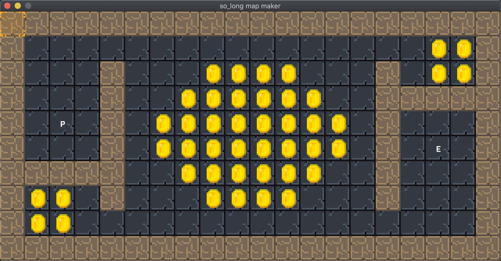

# SLMM - SO_LONG MAP MAKER

Create your text based .ber maps for the 42 school so_long subject convinently in a GUI, using the MLX42 library.



## Download and build - SLMM
```bash
git clone https://github.com/nmihaile/slmm.git slmm
cd slmm
make
```

## Usage
`usage: slmm [-v | -h] map_file`

### HOW-TO:
Use left mouse btn to place a tile. \
Select charecters by typing on the keyboard. [A-Z][0-9] \
Use right mouse btn to delete a tile (puts a floor tile [0])

### KEYBOARD SHORTCUTS:
| SHORTCUT | DESCRIPTION |
|--|--|
| (SHIFT) + 1 | Surrounds the map with walls (1). |
| (SHIFT) + 0 | Clear map: fills the map with (0) and surrounds it | with walls (1). |
| (CMD)   + C | Copy map to clipboard |
|--|--|
| (SHIFT) + (UP ARROW) | Expands map by 1 row at the top. |
| (SHIFT) + (DOWN ARROW) | Expands map by 1 row at the bottom. |
| (SHIFT) + (LEFT ARROW) | Expands map by 1 column on the left. |
| (SHIFT) + (RIGHT ARROW)| Expands map by 1 column on the righ |
|--|--|
| (CMD) + (UP ARROW) | Contract map by 1 row at the bottom. |
| (CMD) + (DOWN ARROW) | Contract map by 1 row at the top. |
| (CMD) + (LEFT ARROW) | Contract map by 1 column on the right. |
| (CMD) + (RIGHT ARROW) | Contract map by 1 column on the lef |

### CUSTOM IMAGES
If you want to use your own images, you can just add a 16x16 pixel .png
in the folder ./imgs/ with the name of the character.
For example <./imgs/M.png> would display your image instead of
the character M.
